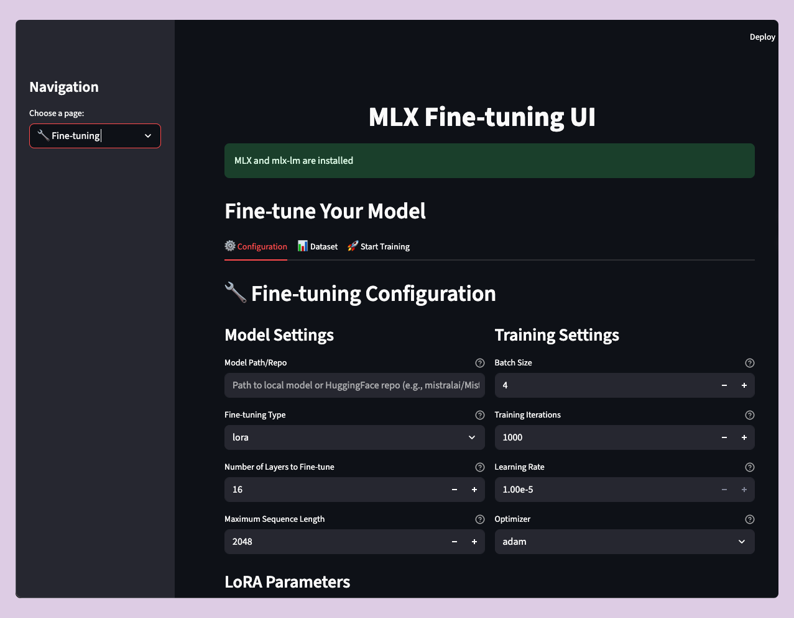

# MLX Fine-tuning UI 🚀

A user-friendly Streamlit interface for fine-tuning large language models using Apple's MLX framework. This application makes it easy for developers and researchers to fine-tune models with LoRA, DoRA, or full fine-tuning approaches.



## Features ✨

- **Easy Fine-tuning**: Configure and run LoRA, DoRA, or full fine-tuning with simple forms
- **Dataset Support**: Use local JSONL files or HuggingFace datasets
- **Model Inference**: Run inference with fine-tuned models or pre-trained models
- **User-friendly Interface**: Intuitive dark-themed UI with real-time progress tracking
- **Multiple Model Sources**: Support for local models, HuggingFace repositories, and fine-tuned adapters
- **Comprehensive Configuration**: All training parameters configurable through the UI
- **Comprehensive Testing**: Full test suite with pytest, coverage reporting, and CI/CD ready
- **Make Commands**: Easy setup, testing, and deployment with simple make commands

## Installation 🛠️

### Prerequisites

- Python 3.8+
- macOS with Apple Silicon (M1/M2/M3) or Intel Mac
- MLX framework installed

### Setup

1. **Clone the repository:**
   ```bash
   git clone https://github.com/adityak74/mlx-ui.git
   cd mlx-ui
   ```

2. **Quick Setup (Recommended):**
   ```bash
   make setup
   ```
   This will install all dependencies and run tests automatically.

3. **Manual Setup:**
   ```bash
   # Install Python dependencies
   pip install -r requirements.txt
   
   # Install MLX and mlx-lm
   pip install mlx
   pip install -e mlx-lm-main/
   
   # Install additional ML dependencies
   pip install datasets transformers
   ```

4. **Verify Installation:**
   ```bash
   make test
   ```

## Usage 🚀

### Starting the Application

**Quick Start:**
```bash
make start
```

**Manual Start:**
```bash
streamlit run app.py
```

The application will open in your browser at `http://localhost:8501`

### Available Commands

The project includes helpful Make commands for development:

```bash
# Setup and Installation
make setup          # Complete setup (install + test)
make install        # Install all dependencies

# Testing
make test           # Run all tests
make test-unit      # Run unit tests only
make test-integration  # Run integration tests
make test-training  # Run actual fine-tuning tests
make test-coverage  # Run tests with coverage report

# Development
make start          # Start the application
make clean          # Clean up temporary files
make help           # Show all available commands
```

### Fine-tuning a Model

1. **Navigate to the Fine-tuning page**
2. **Configure Model Settings:**
   - Choose your base model (local path or HuggingFace repo)
   - Select fine-tuning type (LoRA, DoRA, or Full)
   - Set number of layers to fine-tune
   - Configure sequence length

3. **Configure Training Settings:**
   - Set batch size, iterations, and learning rate
   - Choose optimizer (Adam, AdamW, Muon, SGD, Adafactor)
   - Configure LoRA parameters if using LoRA/DoRA

4. **Upload Dataset:**
   - Choose between local JSONL files or HuggingFace dataset
   - Upload training, validation, and test files
   - Preview your dataset

5. **Start Training:**
   - Review your configuration
   - Click "Start Fine-tuning"
   - Monitor progress and download results

### Running Inference

1. **Navigate to the Inference page**
2. **Load a Model:**
   - Fine-tuned model with adapters
   - HuggingFace model
   - Local model path

3. **Generate Text:**
   - Enter your prompt
   - Configure generation parameters (temperature, top-p, max tokens)
   - Generate and view responses

## Dataset Format 📊

### JSONL Format

Your dataset should be in JSONL format with the following structure:

```jsonl
{"text": "Your training text here"}
{"text": "Another training example"}
{"text": "More training data"}
```

### Required Files

- `train.jsonl` - Training data (required)
- `valid.jsonl` - Validation data (required)
- `test.jsonl` - Test data (optional)

## Configuration Options ⚙️

### Model Settings
- **Model Path/Repo**: Path to local model or HuggingFace repository
- **Fine-tuning Type**: LoRA, DoRA, or Full fine-tuning
- **Number of Layers**: How many layers to fine-tune (-1 for all)
- **Max Sequence Length**: Maximum sequence length for training

### Training Settings
- **Batch Size**: Training batch size
- **Iterations**: Total training iterations
- **Learning Rate**: Training learning rate
- **Optimizer**: Choice of optimizer

### LoRA Parameters (for LoRA/DoRA)
- **Rank**: Rank of LoRA matrices
- **Scale**: Scaling factor for LoRA weights
- **Dropout**: Dropout rate for LoRA layers

### Advanced Settings
- **Validation Batches**: Number of validation batches
- **Steps per Report**: Report training loss frequency
- **Steps per Evaluation**: Validation frequency
- **Save Every**: Model checkpoint frequency
- **Gradient Checkpointing**: Memory optimization
- **Mask Prompt**: Mask prompt tokens in loss

## Supported Models 🎯

The application supports a wide range of models including:

- **Mistral**: Mistral-7B, Mistral-7B-Instruct
- **Llama**: Llama-2-7B, Llama-2-13B, Llama-2-70B, Llama-3.2-1B-Instruct
- **Gemma**: Gemma-2B, Gemma-7B
- **Phi**: Phi-2, Phi-3
- **MLX Community Models**: Optimized models from mlx-community
- **And many more...**

All models from HuggingFace that are compatible with MLX are supported.

## Examples 💡

### Fine-tuning Mistral-7B with LoRA

1. Set model to `mistralai/Mistral-7B-v0.1`
2. Choose fine-tuning type: `lora`
3. Set LoRA rank: `8`
4. Upload your custom dataset
5. Start training

### Running Inference

1. Load your fine-tuned model
2. Enter prompt: "Explain quantum computing in simple terms"
3. Generate response with temperature 0.7

## Testing 🧪

The project includes a comprehensive test suite:

### Running Tests

```bash
# Run all tests
make test

# Run specific test types
make test-unit          # Fast unit tests
make test-integration   # Integration tests
make test-training      # Actual fine-tuning tests (slow)

# Generate coverage report
make test-coverage
```

### Test Coverage

The test suite covers:
- ✅ Fine-tuning functionality (local datasets)
- ✅ HuggingFace dataset integration
- ✅ Model loading and validation
- ✅ Configuration management
- ✅ Adapter file creation and validation
- ✅ Error handling and edge cases

Current test coverage: **39%** and growing!

## Development 💻

### Project Structure

```
mlx-ui/
├── app.py                 # Main Streamlit application
├── requirements.txt       # Python dependencies
├── Makefile              # Development commands
├── pytest.ini           # Test configuration
├── tests/               # Test suite
│   ├── conftest.py      # Test fixtures
│   └── test_training.py # Training tests
├── example_dataset/     # Sample dataset
└── mlx-lm-main/        # MLX-LM submodule
```

### Contributing Guidelines

1. **Fork the repository**
2. **Create a feature branch**: `git checkout -b feature-name`
3. **Make your changes**
4. **Run tests**: `make test`
5. **Commit changes**: `git commit -m "Description"`
6. **Push to branch**: `git push origin feature-name`
7. **Create Pull Request**

## Troubleshooting 🔧

### Common Issues

1. **MLX not found**: Ensure MLX is properly installed for your Mac
2. **Out of memory**: Reduce batch size or enable gradient checkpointing
3. **Import errors**: Check that mlx-lm is installed in editable mode

### Performance Tips

- Use gradient checkpointing for memory optimization
- Start with smaller models for testing (e.g., `mlx-community/Llama-3.2-1B-Instruct-4bit`)
- Use LoRA instead of full fine-tuning for efficiency
- Monitor memory usage during training
- Test with the example dataset first

### Getting Help

1. **Check the logs**: Look at the terminal output for detailed error messages
2. **Run diagnostics**: Use `make test` to verify your setup
3. **Try the example**: Use the included example dataset to test functionality
4. **Check documentation**: Review the configuration options in the UI
5. **Open an issue**: Report bugs or request features on GitHub

## Contributing 🤝

Contributions are welcome! Please feel free to submit issues, feature requests, or pull requests.

## License 📄

This project is licensed under the MIT License - see the LICENSE file for details.

## Acknowledgments 🙏

- Apple MLX team for the excellent framework
- MLX-LM contributors for the fine-tuning implementation
- Streamlit team for the amazing UI framework

---

**Happy Fine-tuning! 🎉**
